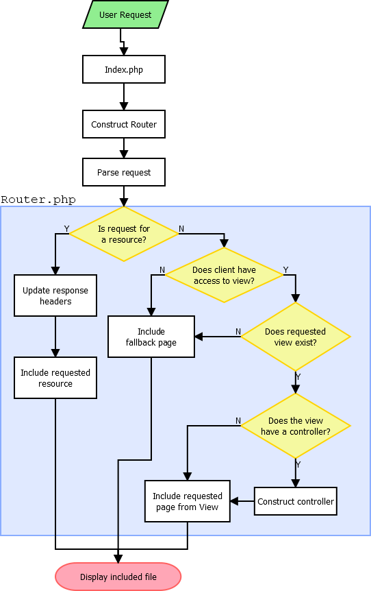

# MVC Framework Manual

This document contains instructions and information on how to use various components in this framework as well as how to create your own.

## Table of Contents

- [MVC Framework Manual](#mvc-framework-manual)
	- [Table of Contents](#table-of-contents)
	- [Todo](#todo)
- [1. Using the Framework](#1-using-the-framework)
	- [Directory Structure](#directory-structure)
		- [`private_core` Directory](#privatecore-directory)
		- [`res` Directory](#res-directory)
	- [Request Handling](#request-handling)
		- [Request Process](#request-process)
			- [Example 1: HTTP GET Request to "*`domain`*`/Home`"](#example-1-http-get-request-to-%22domainhome%22)
			- [Example 2: HTTP GET Request to "*`domain`*`/res/js/sampleScript.js`"](#example-2-http-get-request-to-%22domainresjssamplescriptjs%22)
			- [Request Flowchart](#request-flowchart)

## Todo
- How to add pages
  - Creating a View
  - Creating a Controller
  - Creating a Model
  - Linking MVC components together
  - Hyperlinks to pages and site resources
- How to connect to a database

# 1. Using the Framework

## Directory Structure

The MVC framework is split into two directories - `private_core` and `res`. Outside these directories is the `index.php` file which acts as the front controller for the site.

### `private_core` Directory

This directory contains all objects used by the framework. This folder should be inaccessible to users when accessing the website's directories, should directory access be enabled in our web server.

The `private_core` directory should contain five sub-directories:
- `controllers/`
	> Contains all controllers used in the MVC framework.
- `models/`
	> Contains all models used in the MVC framework.
- `objects/`
	> Contains various PHP objects (classes) used by the application to aid in creating content. User generated objects can be added here if needed.
- `pageComponents/`
	> Contains files that define the header, nav and footer of the website.
- `views/`
	> Contains all pages accessible to the user via a URL.


### `res` Directory

This directory contains resources used by pages on the website. This includes media files, JavaScript files, CSS stylesheets or any other resources. This file should be publicly accessible to the user. It does not have to be a browseable directory if your web server allows directory browsing.

# 2. Technical Details

This section explains how various components of the system work when used. Diagrams and flowcharts will be used as often as possible to aid in explanation.

## Request Handling

This framework provides basic handling to various requests made to the site. This section assumes a basic web server configuration is used to handle HTTP requests to the site, however most web server configurations should work.

It is assumed that the web server reads an `index.php` file as the default page for the site. Some web servers may need this to be configured such as Microsoft IIS.

### Request Process

The following examples demonstrate how the framework handles and responds to requests made by the user. No user configuration is needed to produce any of the example unless specified.

A flowchart is displayed below that summarises the request flow.

#### Example 1: HTTP GET Request to "*`domain`*`/Home`"

This example outlines how a request is made to view the "Home" page.

1. A user sends the request "*`domain`*`/Home`" to the web server. This request is routed through `index.php`.
2. In `index.php`, a new Router object is created. This parses the URI request made by the user.
3. The router checks if the requested URI is a resource or a webpage. If it finds that the request is a resource, it returns the resource. In this case, it is not a resource and it determines that the request is for the `Home` view in `private_core/views`.
4. The router then checks for a controller for the specified view. If a controller exists with the same name as the view, i.e. "Home", it is created and included. A model is created if the controller specifies within its code.
5. In `index.php`, the controller is retrieved (if one exists) and the header, nav, `default.php` in the Home view directory and footer are added to the page. The default page is used as no sub-page is specified in the url, e.g. `Home/subpage`.
6. The request is completed and the page is displayed.

#### Example 2: HTTP GET Request to "*`domain`*`/res/js/sampleScript.js`"

1. A user sends the request "*`domain`*`/res/js/sampleScript.js`" to the web server. This request is routed through `index.php`.
2. In `index.php`, a new Router object is created. This parses the URI request made by the user.
3. The router checks if the requested URI is a resource or a webpage. In this case, it found to be in the `res` directory and is thus a resource.
4. The headers for the requested resources are sent and the file is included.
5. The request is completed and the resource is returned.

#### Request Flowchart

The flowchart below summarises the request process.



## Page Access Control

There are two methods of access control for this framework. These are explained below.
All access control methods require a user login system to define a user group the user belongs to.

### File-Based Access Control (Access Control List)

This access control method uses a JSON file as an access control list (ACL) to define what user groups can access what views.

This method of access control is best if the ACL will not need to change frequently. For example, if new user groups or views are not added frequently or at all, this method is easiest to implement as everything is defined in a single file.

The file-based ACL list should be stored in `private_core/objects/acl.json`.
Requirements of this file are:

- There must be a "`UserGroups`" key, which contains keys of user group names and the views they are permitted to view.
- A "`None`" key should exist if some views do not need any authentication.
- If a view has multiple pages, each page that the user group is permitted to access should be stored in a list.
- If any view or page within a view is allowed, an asterisk `*` can be used to denote access to any view or page within the view.

Below is an example `acl.json` file:
```json
"UserGroups": {
	"None": {
		"Home": "*"
	},
	"Admin": "*",
	"GroupA": {
		"Home": "*",
		"Sample": "*"
	},
	"GroupB": {
		"Home": "*",
		"Sample": [
			"default",
			"pageA"
		],
		"Example": [
			"default"
		]
	}
}
```

Explanation of the above `acl.json` file:
- The "`None`" user group only has access to the "`Home`" view and any of its pages.
- The "`Admin`" user group has access to any view and its pages.
- The "`GroupA`" user group has access to any page in the "`Home`" and "`Sample`" views.
- The "`GroupB`" user group has access to any page in the "`Home`" view, can only access the "`default`" and "`pageA`" pages in the "`Sample`" view and can only view the "`default`" page in the "`Example`" view.

If a particular user group is not permitted to access any pages, omit them from the file.

### Database-Defined Access Control

This access control method defines access control in a database table.

**NOTE**: This feature has yet to be tested. 