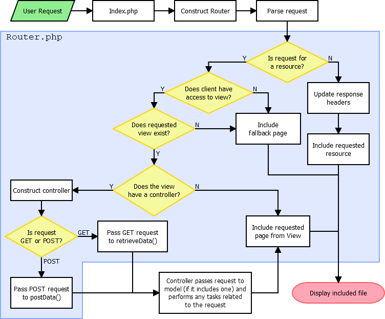

# MVC Framework Manual

This document contains instructions and information on how to use various components in this framework as well as how to create your own.

### **Author:** Kristian Oqueli Ambrose

### **Document Created:** 23 October 2023

---

## Table of Contents

- [MVC Framework Manual](#mvc-framework-manual)
		- [**Author:** Kristian Oqueli Ambrose](#author-kristian-oqueli-ambrose)
		- [**Document Created:** 23 October 2023](#document-created-23-october-2023)
	- [Table of Contents](#table-of-contents)
	- [Todo](#todo)
- [1. Using the Framework](#1-using-the-framework)
	- [Directory Structure](#directory-structure)
		- [`private_core` Directory](#private_core-directory)
		- [`res` Directory](#res-directory)
	- [Creating MVC Components](#creating-mvc-components)
		- [View](#view)
- [2. Technical Details](#2-technical-details)
	- [Request Handling](#request-handling)
		- [Request Process Examples](#request-process-examples)
			- [Example 1: HTTP GET Request to "*`domain`*`/Home`"](#example-1-http-get-request-to-domainhome)
			- [Example 2: HTTP GET Request to "*`domain`*`/res/js/sampleScript.js`"](#example-2-http-get-request-to-domainresjssamplescriptjs)
			- [Example 3: HTTP GET Request to "*`domain`*`/Shop/item?id=123`"](#example-3-http-get-request-to-domainshopitemid123)
			- [Example 4: HTTP POST Request from "*`domain`*`/Orders/new`" to "*`domain`*`/Orders?mode=insert`"](#example-4-http-post-request-from-domainordersnew-to-domainordersmodeinsert)
			- [Request Flowchart](#request-flowchart)
	- [Page Access Control](#page-access-control)
		- [File-Based Access Control (Access Control List)](#file-based-access-control-access-control-list)
		- [Database-Defined Access Control](#database-defined-access-control)
	- [Connecting to a Database](#connecting-to-a-database)
	- [Submitting Forms](#submitting-forms)
		- [Forms Using GET](#forms-using-get)
		- [Forms Using POST](#forms-using-post)

## Todo
- How to add pages
  - Creating a View
  - Creating a Controller
  - Creating a Model
  - Linking MVC components together
  - Hyperlinks to pages and site resources
- How to connect to a database

# 1. About the Framework

This framework is designed to be used with a Microsoft SQL Server database where the objects are the database tables themselves. Unlike other MVC models, database tables are not mirrored as an object in the application layer, i.e. the "Model" in MVC. Instead, the Model provides an interface to retrieve data for a particular view and its controller, which usually correlates to a database table. This allows for database objects to be dynamically created, hence not restricting the framework to a particular design of a database schema.

Furthermore, this framework was designed so that the database contains all the core business logic. That is, data being sent into the database should be checked and validated for integrity at the database level, typically via a stored procedure rather than in the application layer via PHP.

This does not mean no data validation should be done in this framework - Additional validation performed can help ensure the database receives clean data and that its integrity is maintained. Information on this aspect of the framework is described in the [Controller section](#controller).

In summary, the aim of this framework is to provide a front-end to an SQL Server database, with basic security, page routing and data manipulation features.

# 2. Using the Framework

## Directory Structure

The MVC framework is split into two directories - `private_core` and `res`. Outside these directories is the `index.php` file which acts as the front controller for the site.

### `private_core` Directory

This directory contains all objects used by the framework. This folder should be inaccessible to users when accessing the website's directories, should directory access be enabled in our web server.

The `private_core` directory should contain five sub-directories:
- `controllers/`
	> Contains all controllers used in the MVC framework.
- `models/`
	> Contains all models used in the MVC framework.
- `objects/`
	> Contains various PHP objects (classes) used by the application to aid in creating content. User generated objects can be added here if needed.
- `pageComponents/`
	> Contains files that define the header, nav and footer of the website.
- `views/`
	> Contains all pages accessible to the user via a URL.


### `res` Directory

This directory contains resources used by pages on the website. This includes media files, JavaScript files, CSS stylesheets or any other resources. This file should be publicly accessible to the user. It does not have to be a browseable directory if your web server allows directory browsing.

## Creating MVC Components

This section details how to create each MVC component and what to include in each part.

### View

Views contain the content that the user will see. This done primarily though HTML, but to access content created and manipulated by the controller, inline PHP statements can be used.

Ideally, **no logic** should be used in views except for inline if statements if necessary.
The styling of elements is entirely up to the designer and does not need to use the default stylesheets supplied.

#### Creating a View

A view is defined by **a subdirectory** in the `private_core/views` directory. This subdirectory **must contain** a `default.php` file to act as the primary page for this view.

For example, suppose a view with the name of "Marketplace" was to be created. Assume this view would have pages that display various products available in a marketplace. To create this view, a directory named "`Marketplace`" should be placed in the `views` directory. Then, a "`default.php`" file should be created within it. The directory structure would look something like this:

```
private_core/
 ┣━ controllers/
 ┣━ models/
 ┗━ views/
     ┗━ Marketplace/
	     ┗━ default.php
```

#### Accessing Data From the Controller

To access data generated or manipulated from the controller, it must first be set using `setPreparedData()` in the view's controller. Once the data has been set, it can be accessed in the view using the controller's `getPreparedData()` function. Below is an example of this process:

In the controller's `retrieveData()` function:
```php
// $var can be the variable that contains the data, typically as a string to be displayed in the view.
$this->setPreparedData("key", $var);
```
In the view:
```php
<body>
	<p><?= $controller->getPreparedData("key") ?></p>
</body>
```

Note that when outputting data to the view using `getPreparedData()`, the value assigned to it using `setPreparedData()` should be a printable data type, i.e. a string, or number. Arrays and objects cannot be printed and will throw an error.

### Model

The model is responsible for sending and retrieving data from the database and returning it to the controller for displaying in the web browser or for fetching as a GET request. All models should inherit the base model class which provide functions to execute and return result sets from the database preformatted for use in the controller.

#### Creating a Model

This framework includes a template for the model, named "`Model_Template.php`". It might be easiest to copy this file and rename it to make a new model.

When naming a model, the filename should match that of its associated view's directory. Continuing from [the example](#creating-a-view) of creating a view, a model can be added to the view by creating a new file in the `private_core/models` directory with the name "`Model_Marketplace.php`". The directory should look like this once created:

```
private_core/
 ┣━ controllers/
 ┣━ models/
 ┃   ┣━ Model_Marketplace.php
 ┃   ┗━ Model.php
 ┗━ views/
     ┗━ Marketplace/
	     ┗━ default.php
```

Notice how the name of the view for the model is appended after "Model_" for its filename. All models should follow the naming scheme of "Model_<*view name*>", where "<*view_name*>" is the name of the view the model is associated with.

Assuming the new model was created by copying the `Model_Template.php` file, you will need to change the name of the class:

```php
class Model_Marketplace extends Model
```

#### Core Functions

All models have two primary functions: `fetchModelData()` and `sendModelData()`. These are for retrieving data from the database and sending data to the database respectively.

The `fetchModelData()` function should contain logic on what data to fetch based on the page being requested.
This can be achieved using a `switch` statement.
Retrieving data from the database can be achieved using the `queryDatabaseObject()` function. Its results should be stored in an array which is returned to the controller. Below is an example of this process:

```php
public function fetchModelData(array $request = null, string $submitMode = null): array
{
	$modelData = array();

	// The page is set in the constructor.
	switch ($this->getPage()) {
		case 'item':
			// logic specific to "item" page goes here
			break;
		case 'new':
			// logic specific to "new" page goes here
			break;
		default:
			// logic specific to "default" page goes here.
			// For example, querying the "Marketplace table" and storing it in an array for use in the controller.
			$modelData["MarketplaceItems"] = $this->queryDatabaseObject('dbo', "Marketplace");
			break;
	}

	// This function is called from the controller's retrieveData function and is returned there.	
	return $modelData;
}
```

The `sendModelData()` function should contains logic that determines what stored procedure is used to send data to the database. In this framework, **all data** being sent to the database **must** be sent via a stored procedure.

```php
SHOW EXAMPLE OF FUNCTION HERE
```


### Controller

The controller should handle all logic that pertains to what content needs to be loaded per page in for its associated view. All controllers should inherit the base controller class which provides functions to communicate with the model, and hence retrieve data from the database. The base Controller class should not be tampered with in any way.

#### Creating a Controller

This framework includes a template for the controller, named "`Controller_Template.php`". When creating a new controller it might be easiest to start by making a copy of this file and renaming it.

Much like the model, when naming a controller, the filename should match that of it's associated view's directory. The naming scheme is the same as the controller's: "Controller_<*view name*>", where "<*view_name*>" is the name of the view the controller is associated with.

```
private_core/
 ┣━ controllers/
 ┃   ┣━ Controller_Marketplace.php
 ┃   ┗━ Controller.php
 ┣━ models/
 ┃   ┣━ Model_Marketplace.php
 ┃   ┗━ Model.php
 ┗━ views/
     ┗━ Marketplace/
	     ┗━ default.php
```

Assuming the new controller was created by copying the `Controller_Template.php` file, you will need to change the name of the class and the model it is including.

```php
class Controller_Marketplace extends Controller
```

TODO

# 3. Technical Details

This section explains how various components of the system work when used. Diagrams and flowcharts will be used as often as possible to aid in explanation.

## Request Handling

This framework provides basic handling to various requests made to the site. This section assumes a basic web server configuration is used to handle HTTP requests to the site, however most web server configurations should work.

It is assumed that the web server reads an `index.php` file as the default page for the site. Some web servers may need this to be configured such as Microsoft IIS.

### Request Process Examples

The following examples demonstrate how the framework handles and responds to requests made by the user. No user configuration is needed to produce any of the example unless specified.

A flowchart is displayed below that summarises the request flow.

#### Example 1: HTTP GET Request to "*`domain`*`/Home`"

> This example outlines how a request is made to a view named "Home". This view has no controller or model associated with it.

1. A user sends the request "*`domain`*`/Home`" to the web server. This request is routed through `index.php`.
2. In `index.php`, a new Router object is created. This parses the URI request made by the user.
3. The router checks if the requested URI is a resource or a webpage. If it finds that the request is a resource, it returns the resource. In this case, it is not a resource and it determines that the request is for the `Home` view in `private_core/views`.
4. The router then checks for a controller for the specified view. If a controller exists with the same name as the view, i.e. "Home", it is created and included. A model is created if the controller specifies within its code. In this case, no controller exists so no controller is built.
5. In `index.php` the header, nav, `default.php` in "`private_core/views/Home`" and footer are included in the page.
6. The request is completed and the page is displayed.

#### Example 2: HTTP GET Request to "*`domain`*`/res/js/sampleScript.js`"

> This example details how a request is made to retrieve a resource fro the server.

1. A user sends the request "*`domain`*`/res/js/sampleScript.js`" to the web server. This request is routed through `index.php`.
2. In `index.php`, a new Router object is created. This parses the URI request made by the user.
3. The router checks if the requested URI is a resource or a webpage. In this case, it found to be in the `res` directory and is thus a resource.
4. The headers for the requested resources are sent and the file is included.
5. The request is completed and the resource is returned.

#### Example 3: HTTP GET Request to "*`domain`*`/Shop/item?id=123`"

> This example outlines how a request is made to the view names "Shop" and it's page "item". It also contains a GET variable `id`. This view has a controller and model associated with it.

1. A user sends the request "*`domain`*`/Shop/item?id=123`" to the web server. This request is routed through `index.php`.
2. In `index.php`, a new Router object is created. This parses the URI request made by the user.
3. The router checks if the requested URI is a resource or a webpage. In this case, it is not found to be a resource and checks to ensure that the specified view and page exists. It finds that the requested view exists under "`private_core/views/Shop/item.php`".
4. The router checks to see if a controller exists with the same name as the view. It finds one in `private_core/controllers/Controller_Shop.php` and constructs it. In this controller, a model is also specified and is constructed.
5. Since a controller exists, the GET request is sent into the `retrieveData()` function within its class. This function also passes on the GET request to the model so it can query the database for the shop item with id "`123`".
6. After the model queries the database and retrieves its response, it is returned back to the controller and the controller can then perform the tasks it needs to **based on the page being requested**. This is best achieved through a switch statement where each case are the pages in the view:
```php
$modelData = $this->getModel()->fetchModelData($request);

switch ($this->getPage()) {
	case 'item':
		// logic specific to "item" page goes here
		break;
	case 'new':
		// logic specific to "new" page goes here
		break;
	default:
		// logic specific to "default" page goes here
		break;
}
```
7. After the controller has completed its tasks, the header, nav, `item.php` in "`private_core/views/Shop`" and footer are included via `index.php`.
8. The request is completed and the content is displayed to the user.

#### Example 4: HTTP POST Request from "*`domain`*`/Orders/new`" to "*`domain`*`/Orders?mode=insert`"

> This example demonstrates how a POST request is made from a form on the "new" page in the "Orders" view with the `action` attribute of the form pointing to `Orders?mode=insert`.
> The view in this example has a controller and router.

1. 

#### Request Flowchart

The flowchart below summarises the request process.



## Page Access Control

There are two methods of access control for this framework. These are explained below.
All access control methods require a user login system to define a user group the user belongs to.

### File-Based Access Control (Access Control List)

This access control method uses a JSON file as an access control list (ACL) to define what user groups can access what views.

This method of access control is best if the ACL will not need to change frequently. For example, if new user groups or views are not added frequently or at all, this method is easiest to implement as everything is defined in a single file.

The file-based ACL list should be stored in `private_core/objects/acl.json`.
Requirements of this file are:

- There must be a "`UserGroups`" key, which contains keys of user group names and the views they are permitted to view.
- A "`None`" key should exist if some views do not need any authentication.
- If a view has multiple pages, each page that the user group is permitted to access should be stored in a list.
- If any view or page within a view is allowed, an asterisk `*` can be used to denote access to any view or page within the view.

Below is an example `acl.json` file:
```json
"UserGroups": {
	"None": {
		"Home": "*"
	},
	"Admin": "*",
	"GroupA": {
		"Home": "*",
		"Sample": "*"
	},
	"GroupB": {
		"Home": "*",
		"Sample": [
			"default",
			"pageA"
		],
		"Example": [
			"default"
		]
	}
}
```

Explanation of the above `acl.json` file:
- The "`None`" user group only has access to the "`Home`" view and any of its pages.
- The "`Admin`" user group has access to any view and its pages.
- The "`GroupA`" user group has access to any page in the "`Home`" and "`Sample`" views.
- The "`GroupB`" user group has access to any page in the "`Home`" view, can only access the "`default`" and "`pageA`" pages in the "`Sample`" view and can only view the "`default`" page in the "`Example`" view.

If a particular user group is not permitted to access any pages, omit them from the file.

### Database-Defined Access Control

This access control method defines access control in a database table.

## Connecting to a Database

All communications to the database are done through the Model component of the MVC architecture model. Currently, this framework only allows one database connection for the application.

To specify a database to connect to, you can edit the connection string in the `newConnection()` function found in `private_core/models/Model.php`.

```php
$serverName = "localhost";
$connectionInfo = array("Database" => "DB_NAME", "UID" => 'sa', "PWD" => 'password');
```

- Replace the `$serverName` variable to the IP address or hostname of the computer that hosts the SQL Server instance you wish to connect to.
- In the `$connectionInfo` array, update the values of each key to their respective values to specify which database hosted on the server to connect to.
- More information on SQL Server connections can be found on [Microsoft's official website - sqlsrv_connect](https://learn.microsoft.com/en-us/sql/connect/php/sqlsrv-connect?view=sql-server-ver16).

## Submitting Forms

HTML forms can be submitted via a POST or GET request method. Depending which method you choose, the way it is handled by the framework will differ.

Generally, if you wish to send data from a form into the database, the POST request method should be used.

### Forms Using GET

If a form is submitted using the GET method, it's inputs will be passed to the page like a typical GET request with each variable and value visible in the URL of the destination.

If the destination is a view with a controller, these GET variables will be passed into the controller's `retrieveData()` function and can be handled through there. [Example 3](#example-3-http-get-request-to-domainshopitemid123) in the Request Handling section provides an example of this.

### Forms Using POST

Most forms in this framework should utilise the POST request method unless the form does not need to send data for processing into the database or other external location.

When the framework detects a POST request, if the request is made to a View with a controller and model, it forwards the request to the controller's `sendModelData()` function. [Example 4](#example-4-http-post-request-from-domainordersnew-to-domainordersmodeinsert) in the Request Handling section details and example of this process.
